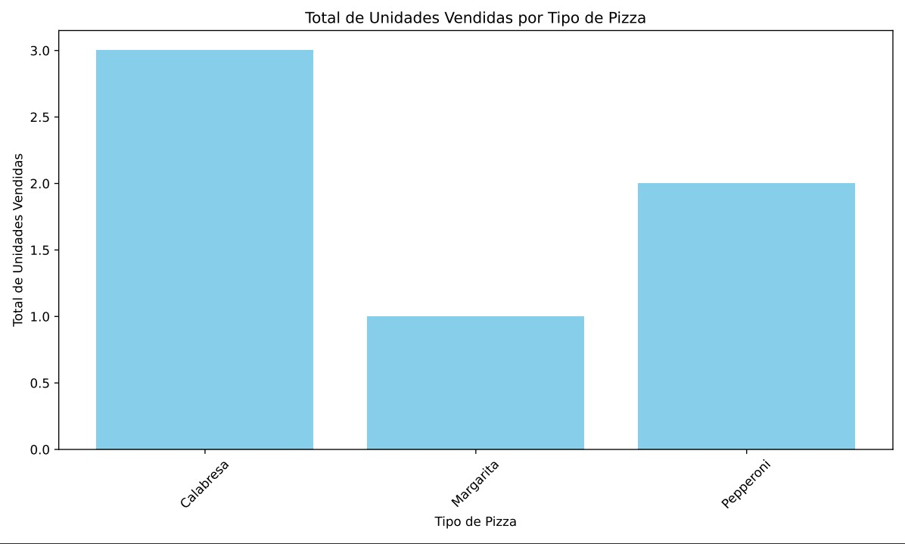
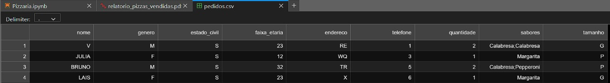

# PizzaOrderSystem

Projeto para estudos de Data Science utilizando Python.<br>
Sistema de pedidos de pizza para controle de estoque e análise de vendas.

## Sobre

Este projeto tem como objetivo gerenciar pedidos de pizza, controlar o estoque de ingredientes e gerar relatórios de vendas diárias. O sistema permite registrar fornecedores, adicionar e remover ingredientes do estoque, fazer pedidos online e gerar relatórios e gráficos sobre as vendas.

## Funcionalidades

1. **Registro de Fornecedores**: Adicione fornecedores e produtos fornecidos.
2. **Controle de Estoque**: Adicione e remova ingredientes do estoque.
3. **Sistema de Pedidos Online**: Faça pedidos de pizza e verifique a disponibilidade de ingredientes.
4. **Relatório de Vendas Diário**: Gere relatórios sobre vendas e exporte gráficos em formato PDF.

## Dataset

O dataset `pedidos.csv` possui as seguintes colunas:
- nome, genero, estado_civil, faixa_etaria, endereco, telefone, quantidade, sabores e tamanho 

## Tarefas

### Situação Problema

Imagine que uma nova pizzaria foi aberta no seu bairro e o proprietário te contratou para que você construa um código em Python para melhorar os rendimentos na parte de Delivery online. Na primeira reunião que vocês tiveram, o proprietário descreveu as suas principais necessidades:

- **Registrar Fornecedores de Ingredientes**: Adicione fornecedores e produtos fornecidos.
- **Controle de Estoque**: Adicione e remova ingredientes do estoque.
- **Pedidos Online**: Quando o cliente fizer um pedido online, o sistema deve:
  - Mostrar o Menu das Pizzas disponíveis (levando em conta o estoque no momento) com seus respectivos preços.
  - Coletar as seguintes informações do cliente:
    - Nome
    - Gênero
    - Estado Civil
    - Faixa Etária
    - Endereço
    - Telefone
    - Quantidade de pizzas
    - Sabor(es) (Mostrar uma mensagem se o cliente pedir algo que não está no estoque)
    - Tamanho
  - Emitir um Comprovante do Pedido contendo todas as informações para que a equipe possa fazer a pizza. O comprovante deve ser padronizado com letra maiúscula e sem caracteres especiais.
- **Relatórios Diários**: Ao final do dia, o sistema deve fornecer o balanço com:
  - Total de unidades vendidas por tipo de pizza.
  - Total da Receita (total em R$) por tipo de pizza para identificar qual pizza vende mais.
  - Ticket médio (total de vendas R$ dividido pela quantidade de clientes).
  - Análise de clientes: quem compra mais (homens ou mulheres), qual faixa etária é predominante e o estado civil (solteiros ou casados).

## Screenshots




## Passos para Instalação

1. **Clone o repositório**

    ```sh
    git clone https://github.com/victordscabral/DS_PizzaOrderSystem.git
    ```

2. **Navegue até o diretório do projeto**

    ```sh
    cd PizzaOrderSystem
    ```

3. **Crie um ambiente virtual (opcional, mas recomendado)**

    ```sh
    python3 -m venv env
    source env/bin/activate  # Para Linux e macOS
    .\env\Scripts\activate  # Para Windows
    ```

4. **Instale as dependências**

    ```sh
    pip install pandas matplotlib
    ```

5. **Execute o script**

    ```sh
    python pizza_order_system.py
    ```

## Uso

1. **Inicialização**: Ao iniciar o script, ele carregará os pedidos salvos anteriormente do arquivo `pedidos.csv` se existir.
2. **Fazer Pedido**: Use a função `fazer_pedido()` para registrar novos pedidos.
3. **Gerar Relatório**: Chame `gerar_relatorio()` para visualizar e exportar o relatório de vendas diárias em PDF.

